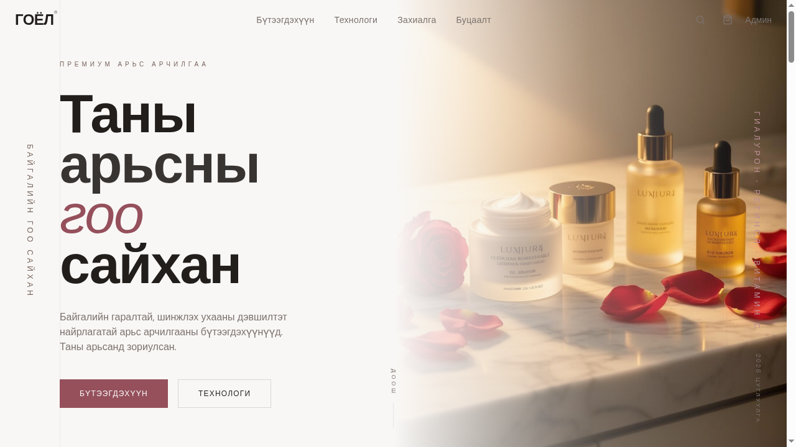
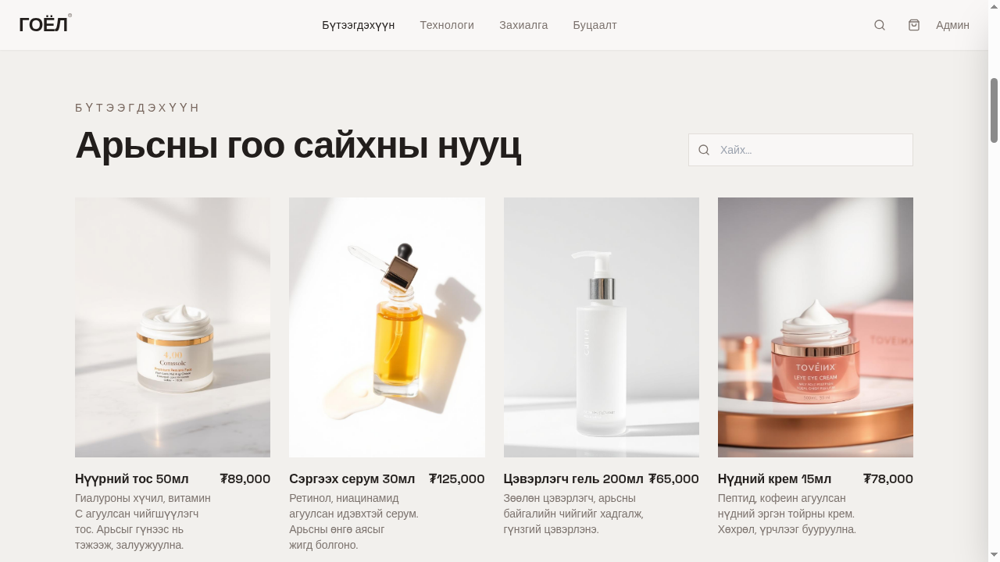
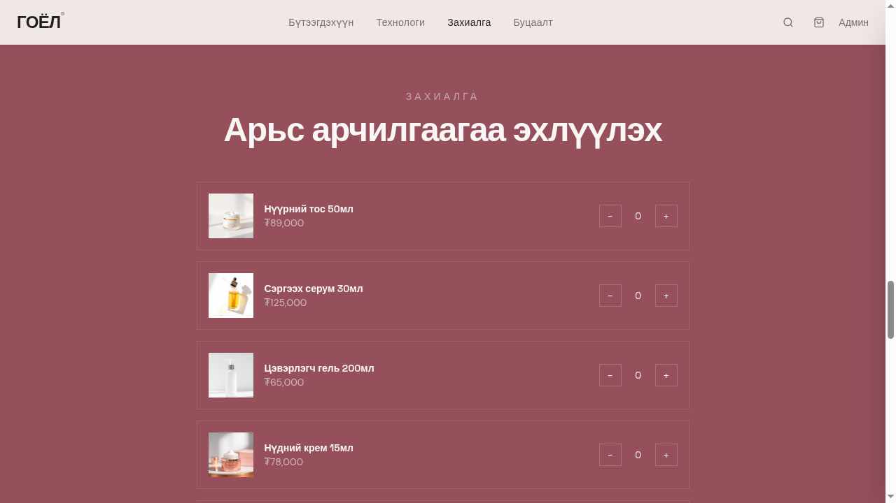
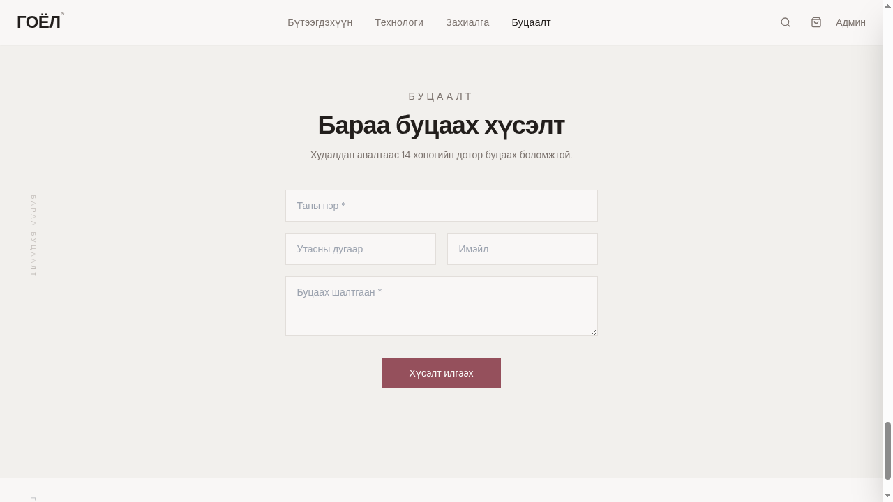
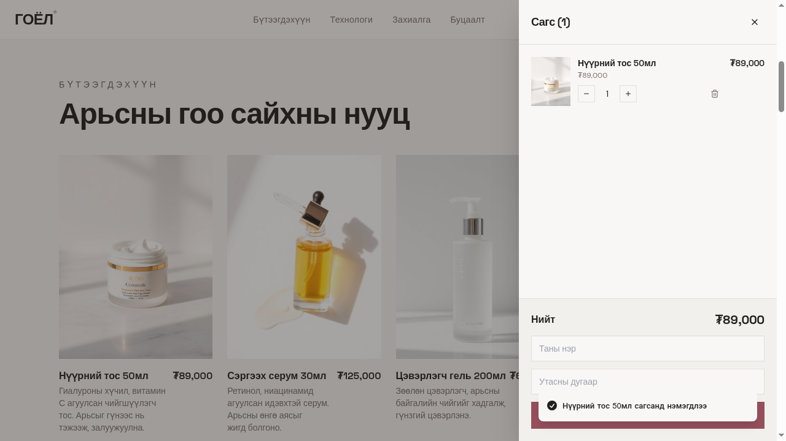
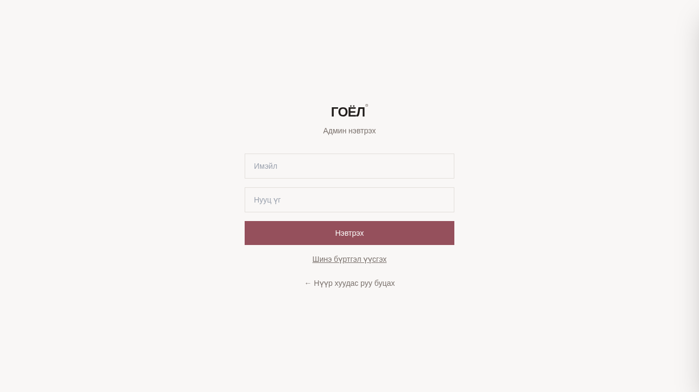

# ГОЁЛ® — Гоо сайхан, арьс арчилгааны цахим дэлгүүр

> Премиум зэрэглэлийн арьс арчилгааны бүтээгдэхүүний онлайн худалдаа, захиалга, буцаалт, удирдлагын систем.

Энэхүү баримт бичиг нь төслийн **бүх функц**, **технологийн стек**, **өгөгдлийн сангийн бүтэц**, **аюулгүй байдлын тохиргоо**, **код жишээнүүд** болон **дэлгэцийн зургийн (screenshots)** дэлгэрэнгүй танилцуулга юм.

---

## 📑 Агуулга

1. [Төслийн товч танилцуулга](#-төслийн-товч-танилцуулга)
2. [Технологийн стек](#-технологийн-стек)
3. [Төслийн бүтэц](#-төслийн-бүтэц)
4. [Хуудаснууд (Pages) ба screenshots](#-хуудаснууд-pages-ба-screenshots)
5. [Үндсэн функцууд — код жишээтэй](#-үндсэн-функцууд--код-жишээтэй)
6. [Өгөгдлийн сангийн бүтэц](#-өгөгдлийн-сангийн-бүтэц)
7. [Аюулгүй байдал ба эрхийн удирдлага](#-аюулгүй-байдал-ба-эрхийн-удирдлага)
8. [Дизайн систем](#-дизайн-систем)
9. [Хэрэглэгчийн урсгал](#-хэрэглэгчийн-урсгал)
10. [Локал орчинд ажиллуулах](#-локал-орчинд-ажиллуулах)
11. [Цаашдын хөгжүүлэлт](#-цаашдын-хөгжүүлэлт)

---

## 🌸 Төслийн товч танилцуулга

**ГОЁЛ®** нь Монгол хэл дээрх премиум арьс арчилгааны брэндийн вэбсайт юм:

- **Үйлчлүүлэгчийн хэсэг (Landing page):** Бүтээгдэхүүний жагсаалт, захиалга, буцаалт хүсэлт.
- **Удирдлагын хэсэг (Admin panel):** Нэвтрэлттэй дашбоард — захиалга, бүтээгдэхүүн, буцаалт, статистик.
- **Сагсны систем:** Хажуу талаас гарч ирдэг (slide-out) сагс.
- **Хайлт:** Бүтээгдэхүүний нэр, тайлбараар шүүх.

Бүх агуулга **Монгол хэл** дээр, дизайн нь **сарнайн алт (rose-gold)**, **сүүн цагаан (cream)**, **тапе (taupe)** өнгөний палитртай, **босоо бичвэр (vertical typography)** бүхий минимал, эдиториал стилтэй.

---

## 🛠 Технологийн стек

### Frontend
| Технологи | Хувилбар | Зориулалт |
|-----------|----------|-----------|
| **React** | 18 | UI бүтээх үндсэн сан |
| **TypeScript** | 5 | Төрлийн аюулгүй байдал |
| **Vite** | 5 | Хурдан build хэрэгсэл |
| **Tailwind CSS** | 3 | Utility-first CSS |
| **shadcn/ui** | latest | Дахин ашиглагддаг UI компонентууд |
| **React Router** | 6 | Хуудас хоорондын навигаци |
| **TanStack Query** | 5 | Серверийн өгөгдөл удирдах, кэшлэх |
| **Recharts** | latest | Дашбоардын график |
| **Lucide React** | latest | Иконууд |
| **Sonner** | latest | Toast мэдэгдэл |

### Backend
| Үйлчилгээ | Зориулалт |
|-----------|-----------|
| **Supabase Auth** | Админ нэвтрэлт (email + password) |
| **Supabase Database (PostgreSQL)** | Бүтээгдэхүүн, захиалга, буцаалт, эрхийн хүснэгт |
| **Supabase Storage** | Бүтээгдэхүүний зургийн сан (`product-images` bucket) |
| **Row Level Security (RLS)** | Хүснэгт бүрд хандалтын дүрэм |

---

## 📂 Төслийн бүтэц

```
src/
├── assets/                    # Зураг (hero, бүтээгдэхүүн, гар урлал)
├── components/
│   ├── ui/                    # shadcn/ui компонентууд
│   ├── AdminDashboard.tsx     # Админы статистикийн дашбоард (Recharts)
│   ├── CartDrawer.tsx         # Хажуу талын сагс
│   ├── CraftSection.tsx       # "Технологи" хэсэг
│   ├── Footer.tsx             # Хөл хэсэг
│   ├── HeroSection.tsx        # Нүүрний баннер
│   ├── Navbar.tsx             # Дээд цэс + хайлт + сагсны товч
│   ├── OrderSection.tsx       # Захиалгын форм
│   ├── ProductsSection.tsx    # Бүтээгдэхүүний жагсаалт
│   └── ReturnSection.tsx      # Барааны буцаалтын форм
├── context/
│   └── CartContext.tsx        # Сагсны global state
├── hooks/
│   └── useScrollReveal.ts     # Scroll-оор гарч ирэх анимаци
├── integrations/supabase/
│   ├── client.ts              # Supabase клиент (auto-generated)
│   └── types.ts               # DB төрлүүд (auto-generated)
├── pages/
│   ├── Index.tsx              # Үндсэн нүүр хуудас
│   ├── Admin.tsx              # Админ панел
│   ├── AdminLogin.tsx         # Админ нэвтрэх хуудас
│   └── NotFound.tsx           # 404 хуудас
├── App.tsx                    # Үндсэн router + провайдерууд
├── main.tsx                   # Entry point
└── index.css                  # Global стилийн систем (HSL token-ууд)

supabase/
├── config.toml                # Supabase тохиргоо
└── migrations/                # SQL migration файлууд

docs/
└── screenshots/               # README-д ашиглагдах preview зурагнууд
```

---

## 📸 Хуудаснууд (Pages) ба screenshots

### 1. Нүүр баннер — `HeroSection`

> Брэндийн анхны харагдац: **"Таны арьсны гоо сайхан"** — том типографи, премиум бүтээгдэхүүний зураг, хажуугийн босоо лейблүүд.



**Файл:** `src/components/HeroSection.tsx`
**Онцлог:**
- Vertical RL бичвэр (`БАЙГАЛИЙН ГОО САЙХАН`, `ГИАЛУРОН · РЕТИНОЛ · ВИТАМИН C`)
- 2 CTA товч — "БҮТЭЭГДЭХҮҮН" / "ТЕХНОЛОГИ"
- Доош scroll хийхийг урих vertical "doош" заагч

---

### 2. Бүтээгдэхүүний жагсаалт — `ProductsSection`

> **"Арьсны гоо сайхны нууц"** — DB-ээс real-time fetch хийсэн идэвхтэй бүтээгдэхүүнүүд + хайлтын талбар.



**Файл:** `src/components/ProductsSection.tsx`
**Онцлог:**
- TanStack Query-р `products` хүснэгтээс өгөгдөл татах
- Navbar дахь хайлтын custom event (`product-search`)-ийг сонсож шүүх
- Бараа дээр hover хийхэд "Сагсанд нэмэх" товч гарна

---

### 3. Технологи — `CraftSection`

> **"Шинжлэх ухаан байгальтай нэгдэх үед"** — брэндийн философи, идэвхтэй найрлагуудын танилцуулга (Гиалурон, Ретинол, Витамин C, Пептид).


**Файл:** `src/components/CraftSection.tsx`
**Онцлог:**
- Том lifestyle зураг + дотор overlay текст
- 4 баганат найрлагын grid
- Хажуугийн босоо лейбл `ТЕХНОЛОГИ` ба `ШИНЖЛЭХ УХААН · БАЙГАЛЬ`

---

### 4. Захиалга — `OrderSection`

> **"Арьс арчилгаагаа эхлүүлэх"** — бүтээгдэхүүн бүрийн тоо ширхэгийг + / − товчоор тохируулна.



**Файл:** `src/components/OrderSection.tsx`
**Онцлог:**
- Сарнайн алтан өнгийн өргөлт фон
- Тоо тохируулагч (qty selector)
- Submit-д `supabase.from('orders').insert(...)` дуудна

---

### 5. Барааны буцаалт — `ReturnSection`

> **"Бараа буцаах хүсэлт"** — худалдан авалтаас 14 хоногийн дотор буцаах хүсэлт илгээх форм.



**Файл:** `src/components/ReturnSection.tsx`
**Онцлог:**
- Нэр, утас, имэйл, шалтгаан талбартай
- `returns` хүснэгтэд `status = 'pending'` төлөвтэй бичлэг үүсгэнэ
- Нэвтрэхгүйгээр (anonymous) илгээх боломжтой (RLS-д INSERT public)

---

### 6. Сагс (Cart Drawer)

> Хажуугаас гарч ирдэг сагс — бараа нэмэхэд автоматаар нээгдэнэ.



**Файл:** `src/components/CartDrawer.tsx`
**Онцлог:**
- Бүтээгдэхүүний зураг, нэр, үнэ
- Тоо ширхэг + / −, устгах товч (хогийн сав)
- Доод хэсэгт нийт дүн ба захиалгын талбар
- Toast мэдэгдэл (`Нүүрний тос 50мл сагсанд нэмэгдлээ`)

---

### 7. Админ нэвтрэх — `AdminLogin`

> `/admin` руу орох хаалга — Supabase Auth (email + password)-аар нэвтрэх.



**Файл:** `src/pages/AdminLogin.tsx`
**Онцлог:**
- Имэйл / Нууц үг талбар
- "Нэвтрэх" / "Шинэ бүртгэл үүсгэх" / "Нүүр хуудас руу буцах" холбоосууд
- Нэвтэрсний дараа `user_roles`-оос `admin` эрх шалгана

---

## ⚙️ Үндсэн функцууд — код жишээтэй

### 1. 🛒 Сагсны global state — `CartContext`

`src/context/CartContext.tsx` — React Context-ээр бүх аппликейшнд сагс хуваалцана.

```tsx
const { add, remove, setQty, items, total, count } = useCart();

// Бараа нэмэх (drawer автоматаар нээгдэнэ)
add({ id: product.id, name: product.name, price: product.price, image_url: product.image_url });
```

**Гол үйлдлүүд:**
- `add(item, qty?)` — нэмэх (давхар бараа байвал тоог нэмнэ)
- `setQty(id, qty)` — тоо солих (`0` бол устгана)
- `remove(id)` — устгах
- `clear()` — сагсыг хоослох
- Тооцоолол: `total` = нийт үнэ, `count` = барааны нийт тоо

---

### 2. 🔍 Хайлтын custom event

Navbar дахь хайлтын талбар → custom event илгээнэ:

```tsx
// Navbar.tsx
window.dispatchEvent(new CustomEvent("product-search", { detail: query }));

// ProductsSection.tsx
useEffect(() => {
  const handler = (e: CustomEvent) => setQuery(e.detail);
  window.addEventListener("product-search", handler as EventListener);
  return () => window.removeEventListener("product-search", handler as EventListener);
}, []);

const filtered = products?.filter(p =>
  p.name.toLowerCase().includes(query.toLowerCase()) ||
  p.description?.toLowerCase().includes(query.toLowerCase())
);
```

---

### 3. 📦 Захиалга үүсгэх

```tsx
// OrderSection.tsx
const { error } = await supabase.from("orders").insert({
  customer_name: name,
  phone,
  email,
  items: cart.items,           // jsonb баганад хадгалагдана
  total_amount: cart.total,
  status: "pending",
});

if (!error) {
  toast.success("Захиалга амжилттай илгээгдлээ");
  cart.clear();
}
```

---

### 4. ↩️ Барааны буцаалт

```tsx
// ReturnSection.tsx
await supabase.from("returns").insert({
  order_id: orderId,
  customer_name,
  phone,
  email,
  reason,
  items: [],
  status: "pending",
});
```

---

### 5. 🔐 Админ нэвтрэлт + эрх шалгах

```tsx
// AdminLogin.tsx
const { data, error } = await supabase.auth.signInWithPassword({ email, password });

// Admin.tsx — protected route pattern
useEffect(() => {
  supabase.auth.getSession().then(async ({ data: { session } }) => {
    if (!session) return navigate("/admin/login");

    const { data: isAdmin } = await supabase.rpc("has_role", {
      _user_id: session.user.id,
      _role: "admin",
    });

    if (!isAdmin) navigate("/");
  });
}, []);
```

`has_role()` нь `SECURITY DEFINER` функц учир RLS-ийн recursive асуудал үүсэхгүй.

---

### 6. 📊 Recharts дашбоард

```tsx
// AdminDashboard.tsx
import { LineChart, Line, PieChart, Pie, BarChart, Bar, XAxis, YAxis, Tooltip } from "recharts";

// Орлогын чиг хандлага
<LineChart data={revenueByDay}>
  <Line dataKey="amount" stroke="hsl(var(--primary))" />
  <XAxis dataKey="date" /><YAxis /><Tooltip />
</LineChart>

// Захиалгын статусын тархалт
<PieChart><Pie data={statusCounts} dataKey="value" nameKey="status" /></PieChart>

// Шилдэг бүтээгдэхүүн
<BarChart data={topProducts}><Bar dataKey="qty" /></BarChart>
```

---

### 7. 🧴 Бүтээгдэхүүний CRUD + зураг upload

```tsx
// Admin.tsx — Зураг upload
const file = e.target.files?.[0];
const path = `${Date.now()}-${file.name}`;

const { error } = await supabase.storage
  .from("product-images")
  .upload(path, file);

const { data: { publicUrl } } = supabase.storage
  .from("product-images")
  .getPublicUrl(path);

// Дараа нь products-д хадгалах
await supabase.from("products").insert({
  name, price, description, category,
  image_url: publicUrl,
  is_active: true,
});
```

**Update / Delete:**
```tsx
await supabase.from("products").update({ price: 99000 }).eq("id", id);
await supabase.from("products").delete().eq("id", id);
```

---

### 8. 🔄 Захиалга / буцаалтын статус шинэчлэх

```tsx
// pending → confirmed → delivered
await supabase.from("orders").update({ status: "confirmed" }).eq("id", orderId);

// pending → approved / rejected
await supabase.from("returns").update({ status: "approved" }).eq("id", returnId);
```

---

### 9. 🚪 Logout

```tsx
const handleLogout = async () => {
  await supabase.auth.signOut();
  queryClient.clear();          // Кэш цэвэрлэх
  navigate("/admin/login");
};
```

---

### 10. 🌀 Scroll Reveal анимаци

```tsx
// useScrollReveal.ts — IntersectionObserver-ээр элементийг харагдах үед класс нэмнэ
useScrollReveal();
// CSS дотор .reveal { opacity: 0; transform: translateY(20px); transition: ... }
//          .reveal.visible { opacity: 1; transform: none; }
```

---

## 🗄 Өгөгдлийн сангийн бүтэц

### `products` — Бүтээгдэхүүний каталог

| Багана | Төрөл | Тайлбар |
|--------|-------|---------|
| `id` | uuid (PK) | ID |
| `name` | text | Нэр |
| `description` | text | Дэлгэрэнгүй |
| `price` | numeric | Үнэ (₮) |
| `image_url` | text | Зургийн URL |
| `category` | text | Ангилал (cleanser, serum, cream, ...) |
| `is_active` | boolean | Сайтад харагдах эсэх |

### `orders` — Захиалга

| Багана | Төрөл | Тайлбар |
|--------|-------|---------|
| `id` | uuid | Захиалгын дугаар |
| `customer_name`, `phone`, `email` | text | Холбоо барих |
| `items` | jsonb | Сагсан дахь барааны жагсаалт |
| `total_amount` | numeric | Нийт дүн |
| `status` | text | `pending` / `confirmed` / `delivered` |

### `returns` — Барааны буцаалт

| Багана | Төрөл | Тайлбар |
|--------|-------|---------|
| `id` | uuid | ID |
| `order_id` | uuid (FK → orders) | Холбогдох захиалга |
| `customer_name`, `phone`, `email` | text | Холбоо барих |
| `items` | jsonb | Буцаах бараа |
| `reason` | text | Буцаах шалтгаан |
| `status` | text | `pending` / `approved` / `rejected` |

### `user_roles` — Эрхийн хүснэгт

| Багана | Төрөл | Тайлбар |
|--------|-------|---------|
| `user_id` | uuid (FK → auth.users) | Хэрэглэгч |
| `role` | enum (`app_role`) | `admin` / `user` |

> **Чухал:** Эрхийг `profiles` дотор хадгалахгүй — privilege escalation эрсдэлтэй.

### `has_role(_user_id, _role)` — `SECURITY DEFINER` функц

```sql
select public.has_role(auth.uid(), 'admin')
```

---

## 🔒 Аюулгүй байдал ба эрхийн удирдлага

Бүх хүснэгт дээр **Row Level Security (RLS)** идэвхжсэн.

| Хүснэгт | SELECT | INSERT | UPDATE | DELETE |
|---------|--------|--------|--------|--------|
| `products` | Бүгд (зөвхөн идэвхтэй) | Admin | Admin | Admin |
| `orders` | Admin | Бүгд | Admin | Admin |
| `returns` | Admin | Бүгд | Admin | Admin |
| `user_roles` | Өөрөө | Admin | Admin | Admin |

**Аюулгүй байдлын зарчим:**
- ❌ Хэзээ ч `localStorage`-аар админ эсэхийг шалгахгүй.
- ✅ RLS + `has_role()` функцээр сервер тал дээр баталгаажуулна.
- ✅ `service_role` key хэзээ ч client-д орохгүй — зөвхөн `anon key`.

---

## 🎨 Дизайн систем

### Өнгөний палитр (HSL semantic tokens)

`src/index.css`:
- `--background` — сүүн цагаан суурь
- `--foreground` — таплон бараан текст
- `--primary` — сарнайн алтан (rose-gold)
- `--secondary` — таплон сүүдэр
- `--accent` — премиум өргөлт
- `--muted` — нэмэлт зөөлөн өнгө

> ⚠️ Компонент дотор шууд `text-white`, `bg-black` гэх мэт color class бичихгүй. Зөвхөн semantic token (`bg-primary`, `text-foreground` гэх мэт).

### Типографи
- **Vertical RL бичвэр** — гарчиг, лейблүүд дээр.
- **Editorial layout** — сэтгүүлийн стилтэй цэвэрхэн grid.

### Анимаци
- `useScrollReveal` — stagger fade-in
- Parallax hover — Hero дээр

---

## 👤 Хэрэглэгчийн урсгал

### Үйлчлүүлэгчийн урсгал
1. Нүүр хуудаснаас бүтээгдэхүүн үзэх / хайх.
2. **"Сагсанд нэмэх"** → CartDrawer нээгдэнэ.
3. Тоо ширхэг тохируулах.
4. **Захиалга** хэсэгт нэр / утас / имэйл оруулах.
5. **"Захиалах"** → `orders`-д хадгалагдана.
6. Шаардлагатай бол **Буцаалт** хэсгээс хүсэлт илгээх.

### Админы урсгал
1. `/admin/login` → нэвтрэх.
2. **Дашбоард** — Recharts-ын графикууд.
3. **Бүтээгдэхүүн** — CRUD + зураг upload.
4. **Захиалга** — статус шинэчлэх (pending → confirmed → delivered).
5. **Буцаалт** — approve / reject.
6. **Гарах** — `signOut()` + кэш цэвэрлэх.

---

## 🚀 Локал орчинд ажиллуулах

```bash
npm install
npm run dev          # Хөгжүүлэлтийн сервер
npm run build        # Production build
```

`.env` файл нь Lovable Cloud-оор автоматаар үүсгэгдэнэ:
- `VITE_SUPABASE_URL`
- `VITE_SUPABASE_PUBLISHABLE_KEY`
- `VITE_SUPABASE_PROJECT_ID`

---

## 🔮 Цаашдын хөгжүүлэлт

- 📧 Шинэ захиалга ирэхэд имэйл мэдэгдэл (Resend + Edge Function).
- 🏷 Бүтээгдэхүүний ангилалаар шүүх chip-ууд.
- 💳 Төлбөрийн интеграци (QPay / Stripe).
- 🌐 Олон хэлний дэмжлэг (MN / EN).
- 📦 Захиалгын хүргэлтийн tracking.
- ⭐ Хэрэглэгчийн үнэлгээ ба сэтгэгдэл.
- 🔍 Бүтээгдэхүүний дэлгэрэнгүй хуудас (`/products/:id`).

---

## 📜 Лиценз

© ГОЁЛ® — Бүх эрх хуулиар хамгаалагдсан.
